# MotionForge

**Cinematic motion graphics for the open web.**

MotionForge adalah Agent Skill untuk membuat promo, opener, explainer, product demo, kinetic typography, UI showcase, dan visual storytelling berbasis HTML/CSS/JavaScript/GSAP yang terasa seperti **video**, bukan slideshow.

Output default adalah satu `index.html` yang dapat dibuka langsung di browser, autoplay, loop, dan tidak membutuhkan `npm install` hanya untuk ditonton.

## Gallery visual

Berikut gallery style yang digunakan MotionForge sebagai **menu arah visual**. Gallery ini berasal dari [Bang Motion gallery](https://github.com/bangtutorial/bang-motion/tree/main/docs/gallery) dan disimpan sebagai preview di [`docs/gallery/`](docs/gallery/).

Gambar-gambar ini adalah referensi look, ritme, kamera, dan bahasa gerak. MotionForge tidak menyalin teks, palette, font, layout, scene order, karakter, atau signature moment dari contoh.

### Hero gallery

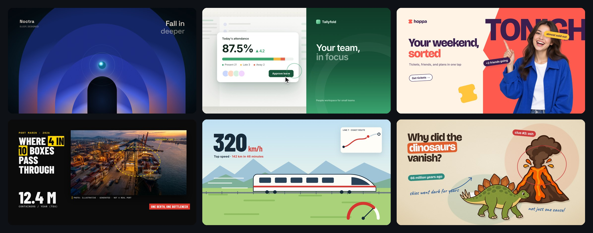

### 01 — Grainy Gradient

Tech, AI, musik, dan creative launch. Menggunakan bentuk gradient bercahaya, grain, serta kamera yang menembus bentuk.

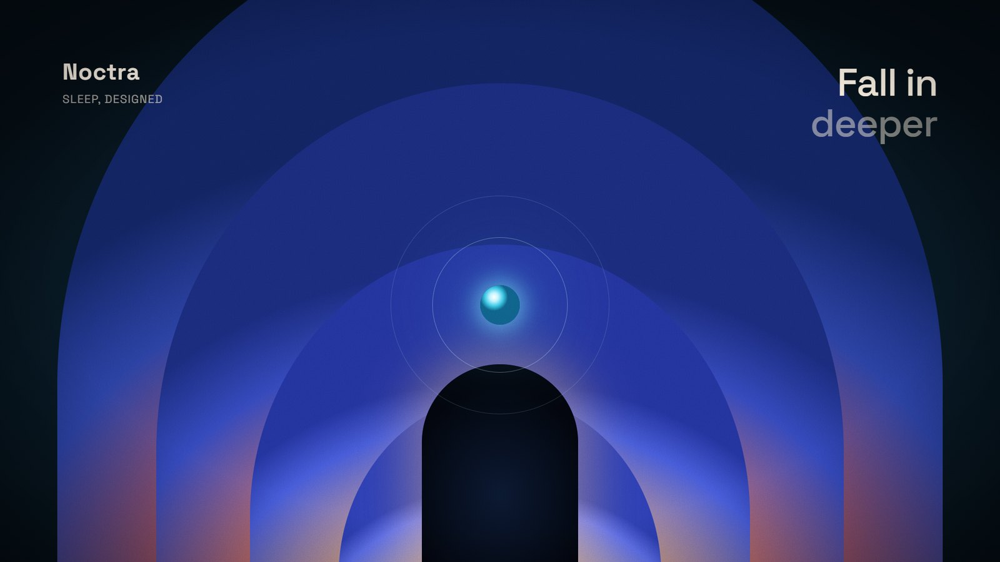

### 02 — Kinetic Colorblock

Festival, campaign, dan announcement. Typography besar dan blok warna bergerak mengikuti beat.

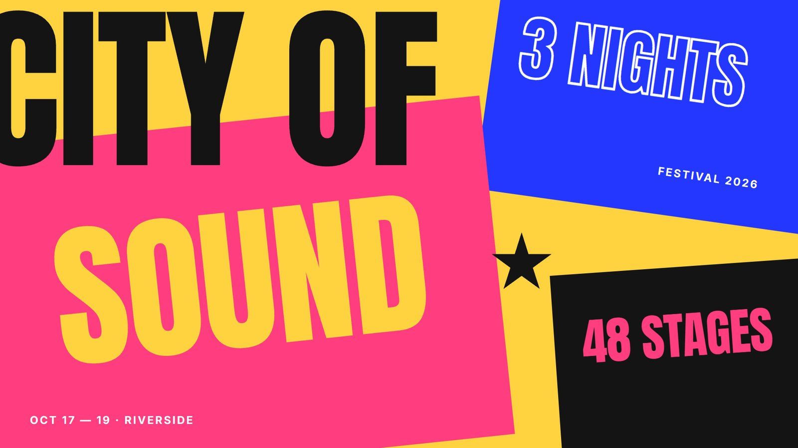

### 03 — SaaS UI Tour

Demo dashboard, SaaS, dan aplikasi. Kamera mengikuti klik penting dan perubahan state UI.

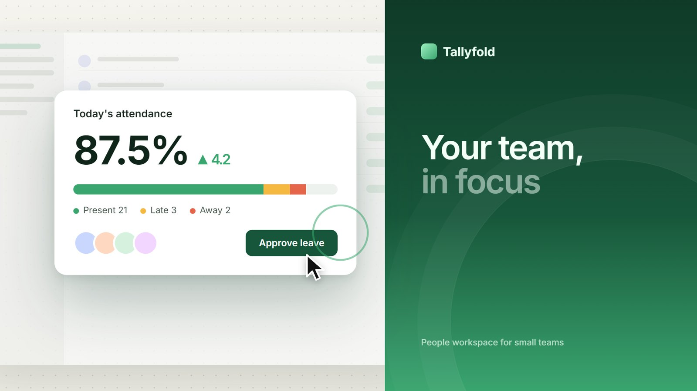

### 04 — Flat Vector

Fintech, consumer app, dan service explainer. Metafora visual flat dengan objek yang bertransformasi.

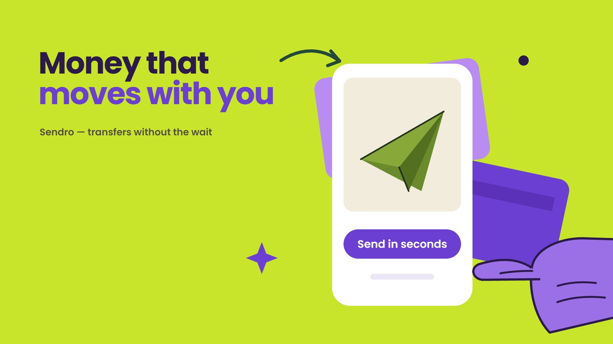

### 05 — Continuous Action

Transportasi, rute, proses, dan kecepatan. Satu subjek terus bergerak dalam dunia visual yang mengalir.

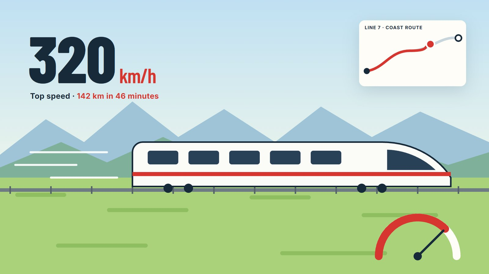

### 06 — Cartoon Stage

Konten edukasi dengan karakter. Satu panggung hidup untuk setiap adegan, karakter memakai jointed rig, tanpa caption berlebihan.


### 07 — Flat Pop with Photos

Campaign, e-commerce, dan consumer app. Photo cutout, sticker, dan brand color field masuk dengan energi pop.


### 08 — White Catalog

Produk, footwear, beauty, dan brand showcase. Product cutout, grid putih, dan typography editorial.

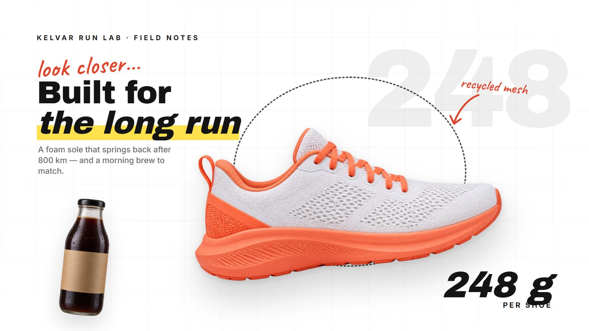

### 09 — Visual Journalism

Berita, isu aktual, dan data story. Foto, source tag, highlighter, dan anotasi dipakai sebagai bukti visual.

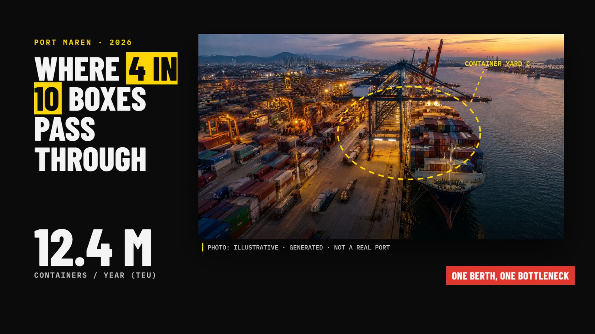

### 10 — Vintage Sketch

Sejarah, biografi, dan dokumenter. Kertas sepia, engraving, serif klasik, dan catatan bergaya arsip.

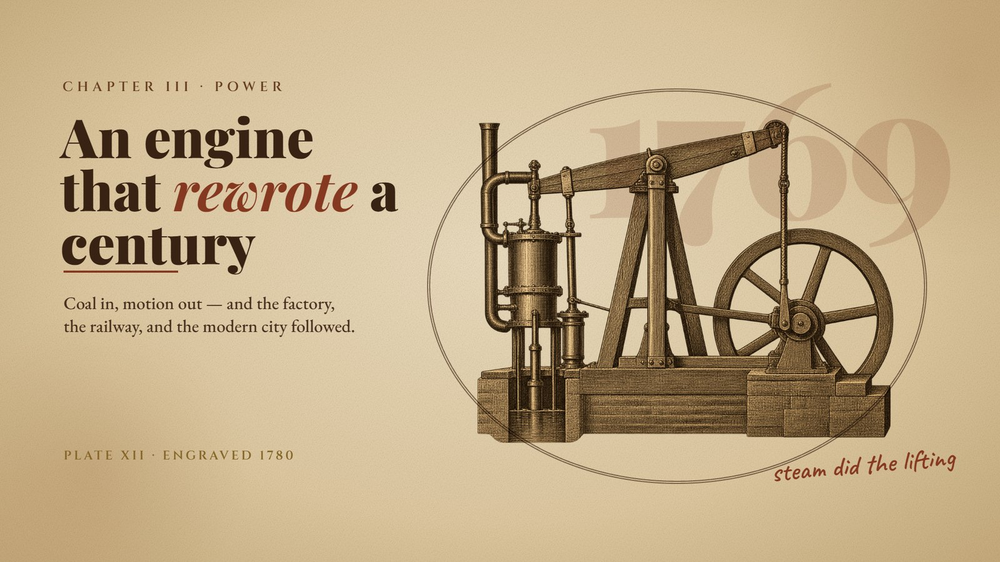

### 11 — Cartoon Collage

Sains, edukasi, dan konten anak. Dunia kertas krem dengan flat illustration cutout, handwriting, dan color pills.

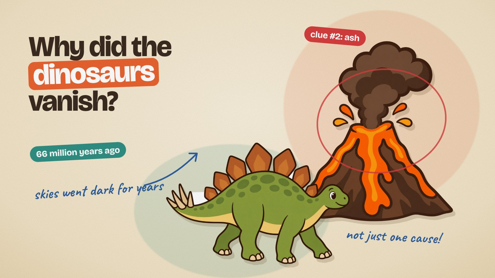

### 12 — More Combinations

Contoh style brief: bandingkan beberapa kandidat konsep lalu pilih satu arah yang paling cocok dengan produk.

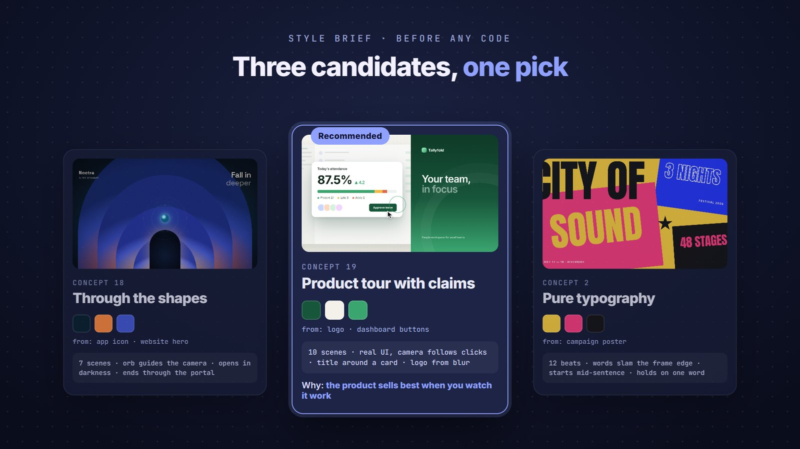

Lihat juga [gallery reference untuk agent](skills/motionforge/references/gallery.md) yang berisi mapping style → starter → use case → bahasa gerak.

## Instalasi dengan `npx skills`

### Mode interaktif

```bash
npx skills add https://github.com/HiuraKiyowoo/MotionForge
```

Pilih skill `motionforge`, agent, scope, dan metode symlink/copy dari UI terminal.

### Instalasi langsung ke Hermes Agent

```bash
npx skills add https://github.com/HiuraKiyowoo/MotionForge \
  --skill motionforge \
  --agent hermes-agent \
  --global \
  --copy \
  --yes
```

### Update instalasi

```bash
npx skills update motionforge
```

### Melihat skill sebelum memasang

```bash
npx skills add https://github.com/HiuraKiyowoo/MotionForge --list
```

## Yang bisa dibuat

- Product opener dan promo
- Website atau SaaS demo
- Kinetic typography
- Bumper, ident, intro, dan outro
- Explainer 16:9 atau 9:16
- Visual storytelling berbasis kamera dan scene
- Animated UI showcase
- Web animation yang siap dirender menjadi MP4

## Struktur repo

```text
MotionForge/
├── README.md
├── LICENSE
├── UPSTREAM.md
├── docs/
│   └── gallery/                # preview gambar gallery di README
└── skills/
    └── motionforge/
        ├── SKILL.md             # entrypoint Agent Skill
        ├── assets/              # starter HTML
        ├── references/          # panduan detail dan style selector
        └── scripts/              # server, snapshot, export, dan tools
```

## Prasyarat

Untuk menonton hasil, cukup gunakan browser modern dan internet bila GSAP/font dimuat dari CDN. Node.js + Puppeteer bersifat opsional untuk snapshot dan render frame. FFmpeg bersifat opsional untuk export MP4. Output tetap harus bisa dibuka tanpa `npm install`.

## Contoh prompt

```text
Gunakan MotionForge untuk membuat promo 30 detik untuk navernovel.my.id.
Gunakan palet charcoal dan cyan, tanpa voice-over, hanya backsound instrumental.
```

```text
Pilih tiga kandidat style dari gallery untuk explainer gunung berapi 9:16,
lalu rekomendasikan satu. Jangan membuat hasil seperti slideshow.
```

## Atribusi dan lisensi

MotionForge dikembangkan dari [Bang Motion](https://github.com/bangtutorial/bang-motion) oleh **Bang Tutorial**. Gallery visual berasal dari [`bang-motion/docs/gallery`](https://github.com/bangtutorial/bang-motion/tree/main/docs/gallery) dan disimpan di `docs/gallery/` sebagai preview. Atribusi, lisensi MIT, serta riwayat upstream dipertahankan di [UPSTREAM.md](UPSTREAM.md).

Lihat [LICENSE](LICENSE) untuk lisensi repository.
